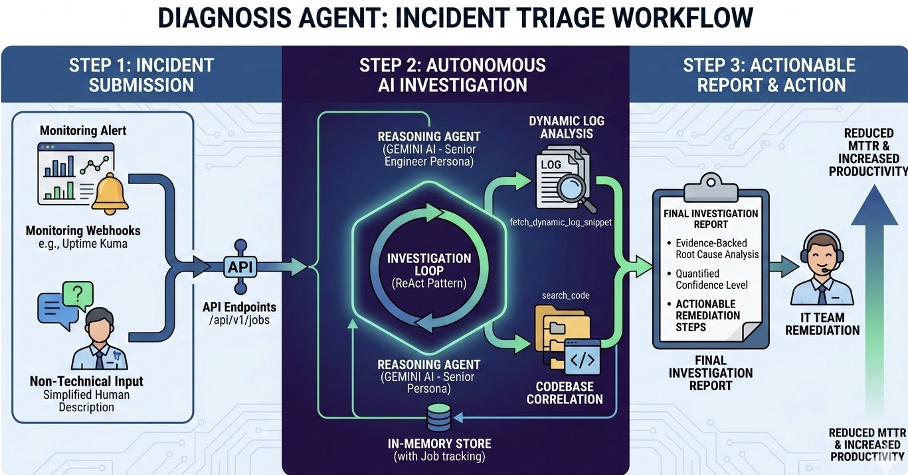
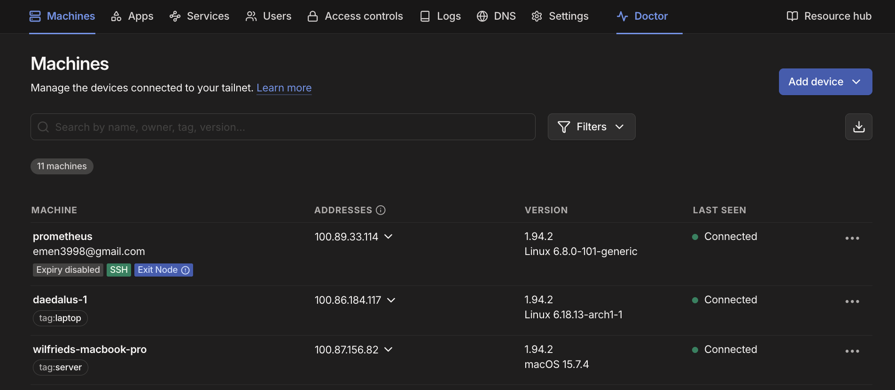

# Diagnosis Agent


A professional-grade log diagnosis agent that leverages Google's Generative AI to autonomously investigate production incidents, analyze logs, search codebases, and formulate root causes.

## Project Vision: Agentic AI for Cloud Ops

Our vision is to build an Agentic AI system tailored specifically for the Cloud Ops domain. While deploying a fully integrated system on Google Cloud or Azure is the ultimate goal—and where the real business value lies—we are simulating the core mechanics locally using VMs and Docker for this hackathon.

### The Problem
Whenever an issue occurs, IT and Ops teams currently have to manually dig through terminals and scroll through endless logs to troubleshoot. It’s tedious, time-consuming, and repetitive.

### The Solution
We are building a system that leverages AI agents and Retrieval-Augmented Generation (RAG) to automate troubleshooting and help Ops teams resolve common issues instantly.

### The Workflow



*   **Smart Log Extraction:** Instead of dumping everything into an LLM, the Agent uses timestamps and specific error tags to run a log-locator function (an approximate algorithm). This pulls only the most relevant log snippets to use as context.
*   **AI Diagnostics:** This precise context is sent to an LLM (like Google Gemini). The AI analyzes the error characteristics and generates a suggested solution along with a diagnostic report.
*   **Human-in-the-Loop UI:** We provide a clean UI for IT administrators to review the AI's diagnostic report—similar to viewing and editing a README.md on GitHub. Crucially, any high-risk scripts or commands suggested by the AI are explicitly flagged for safety.

### Building the Knowledge Base (The RAG Advantage)


If the Ops team reviews the AI's solution, approves it, and it successfully fixes the issue, that entire ticket is saved into a Vector Database. This builds a highly accurate, company-specific corpus.

The next time a similar issue triggers an alert:
*   **Saving Compute:** We don't need to waste AI inference tokens re-analyzing the problem from scratch.
*   **Semantic Search:** The system uses vector/semantic search to find the exact reference case in the database.
*   **Automated or Guided Resolution:** The AI Agent can either execute the validated step-by-step instructions strictly as written, or serve the solution up as a quick reference guide for the Ops staff to implement manually.

## Table of Contents
- [Project Vision: Agentic AI for Cloud Ops](#project-vision-agentic-ai-for-cloud-ops)
    - [The Problem](#the-problem)
    - [The Solution](#the-solution)
    - [The Workflow](#the-workflow)
    - [Building the Knowledge Base (The RAG Advantage)](#building-the-knowledge-base-the-rag-advantage)
- [Features](#features)
- [Architecture](#architecture)
- [Setup and Installation](#setup-and-installation)
- [Configuration](#configuration)
- [API Endpoints](#api-endpoints)
- [Usage](#usage)

## Features

*   **Autonomous Incident Triage:** Employs a Senior Production Incident Engineer persona (ReAct pattern) to investigate and mitigate production failures.
*   **Dynamic Log Analysis:** Uses `fetch_dynamic_log_snippet` to perform targeted temporal searches around incident timestamps, reducing token overhead while increasing context accuracy.
*   **Codebase Search:** Employs a `SelectiveCodeRetriever` to correlate log patterns with specific codebase logic.
*   **Root Cause Formulation:** Delivers evidence-backed hypotheses with quantified confidence levels and actionable remediation steps.
*   **API Interface:** FastAPI-powered endpoints for seamless integration with monitoring webhooks (e.g., Uptime Kuma).
*   **In-Memory Store:** Thread-safe in-memory database for efficient job management and reporting.

## Architecture

The project is structured around several key components:

*   **`main.py`**: The FastAPI application entry point, utilizing modern `lifespan` handlers for managed startup and shutdown of the background worker.
*   **`core/worker.py`**: The `AgentWorker` that orchestrates the `ReasoningAgent` investigation loop.
*   **`agent/core.py`**: Implements the `ReasoningAgent`, a professional-grade AI agent using Google's Generative AI and native function calling for deep investigation.
*   **`memory/store.py`**: An `InMemoryStore` singleton for tracking jobs, updates, and final reports.
*   **`tools/agent_tools.py`**: A suite of professional engineering tools:
    *   `fetch_dynamic_log_snippet`: Retrieves logs within specific time windows.
    *   `search_code`: Performs semantic and keyword searches across the codebase.
    *   `read_incident_context`: Extracts metadata and initial state from the incident job.
    *   `update_investigation_report`: Finalizes the root cause analysis with structured findings.
*   **`tools/retriever_logic.py`**: The logic for surgical code extraction.
*   **`config.py`**: Pydantic-based configuration management with support for `.env` overrides.
*   **`schemas.py`**: Strict validation models for incident payloads and responses.

## Setup and Installation

### Prerequisites

*   Python 3.11 or higher.

### Dependencies

This project uses `uv` for dependency management.

1.  **Install `uv`**: If you don't have `uv` installed, you can install it using pip:
    ```bash
    pip install uv
    ```
    Or refer to the [uv documentation](https://astral.sh/uv/install/) for other installation methods.

2.  **Install project dependencies**:
    ```bash
    uv sync
    ```

### Environment Variables

Create a `.env` file in the project root directory and populate it with the necessary environment variables:

```
GEMINI_API_KEY="YOUR_GEMINI_API_KEY"
```

Replace `"YOUR_GEMINI_API_KEY"` with your actual Google Gemini API key. You can obtain one from the [Google AI Studio](https://makersuite.google.com/app/apikey).

You can also create `.env.local` to override values from `.env` on your machine (for example when rotating API keys).  
Order of precedence in this app is:
1. real environment variables
2. `.env.local`
3. `.env`

After changing either file, restart the API process so the worker picks up the new credentials.

## Configuration

The `config.py` file defines the application's settings. These settings can be configured via environment variables or a `.env` file. Key configurable settings include:

*   `GEMINI_API_KEY`: Your API key for Google Gemini.
*   `GEMINI_MODEL`: The Gemini model to use (default: `gemini-2.0-flash`).
*   `MAX_CONTEXT_FILES`: Maximum number of context files to retrieve.
*   `MAX_CONTEXT_EXCERPT_CHARS`: Maximum characters for code excerpts.
*   `ALLOWED_READ_ROOTS`: Comma-separated list of directories the agent is allowed to read (e.g., `src,app,config,etc,services,scripts,infra,deploy,opt`).
*   `LOG_DIRECTORY`: The directory where log files are stored (default: `logs`).

## API Endpoints

The API is built using FastAPI and provides the following endpoints:

### Core routes (backward compatible)

*   **`POST /api/v1/jobs`**
    *   **Description:** Submits a new incident investigation job.
    *   **Request Body:** `UptimeKumaJobCreate` schema (e.g., from an Uptime Kuma webhook).
    *   **Response:** `JobCreatedResponse` containing the `job_id` and `status` ("queued").

*   **`GET /api/v1/jobs/{job_id}`**
    *   **Description:** Retrieves the current status and details of a specific investigation job.
    *   **Response:** Job details from the in-memory store.

*   **`GET /api/v1/jobs/{job_id}/result`**
    *   **Description:** Retrieves the final investigation report for a completed job.
    *   **Response:** Investigation report details.

*   **`GET /health`**
    *   **Description:** Health check endpoint.
    *   **Response:** `{"status": "alive", "storage": "in-memory"}`

### Frontend compatibility routes (`/api/v1/analysis/*`)

These aliases exist for compatibility with the HackCanada frontend while keeping the current in-memory architecture and worker flow.

*   **`POST /api/v1/analysis/jobs`**
    *   **Behavior:** Alias of `POST /api/v1/jobs`.

*   **`GET /api/v1/analysis/jobs/{job_id}`**
    *   **Behavior:** Alias of `GET /api/v1/jobs/{job_id}`.

*   **`GET /api/v1/analysis/jobs/{job_id}/result`**
    *   **Behavior:** Alias of `GET /api/v1/jobs/{job_id}/result`.

*   **`GET /api/v1/analysis/jobs/{job_id}/summary`**
    *   **Response:** `{ "incident_id": str, "summary_text": str, "summary_markdown": str, "confidence": float }` for completed reports.

*   **`GET /api/v1/analysis/jobs/{job_id}/download`**
    *   **Response:** Downloadable JSON report attachment (`analysis-report-{job_id}.json`).

*   **`GET /api/v1/analysis/incidents`**
    *   **Response shape (frontend list):**  
      `id`, `service`, `serviceType`, `status`, `logs`, `confidence`, `proposedFix`
    *   `proposedFix` is `{ description, steps, markdown, destructiveActions, targetNode }` when a report exists, otherwise `null`.

## Usage

### Running the Application

To run the FastAPI application, ensure you have set up your environment variables and installed dependencies.

```bash
uvicorn src.diagnosis_agent.main:app --host 0.0.0.0 --port 8000
```

The API will be available at `http://localhost:8000`.

### Submitting an Incident (Example)

**1. Cloud Services Monitoring Dashboard**
Real-time visibility into the health and connectivity of nodes within the infrastructure, providing the primary signal for incident detection.


**2. Automated Incident Detection**
The system identifies a service failure (e.g., Plex Media Server "Offline") and captures the diagnostic stream for investigation.


**3. AI-Powered Diagnostic Report**
A comprehensive analysis generated by the Gemini-powered agent, featuring evidence-backed root causes, confidence scores, and surgical remediation steps.


You can use `curl` or any API client to submit an incident job:

```bash
curl -X POST "http://localhost:8000/api/v1/jobs" \
     -H "Content-Type: application/json" \
     -d '{
           "monitor": "my-service-monitor",
           "status": "down",
           "msg": "Service is down, critical errors in logs.",
           "url": "http://my-service.com",
           "time": "2023-10-27T10:00:00Z",
           "log_snippets": [
             {
               "timestamp": "2023-10-27T09:59:00Z",
               "source": "backend-service",
               "line": "ERROR: Database connection failed: Connection refused"
             },
             {
               "timestamp": "2023-10-27T09:59:05Z",
               "source": "backend-service",
               "line": "CRITICAL: Unable to process request, shutting down."
             }
           ],
           "metadata": {"team": "devops", "severity": "P1"}
         }'
```

## Testing

The project uses `pytest` for testing. The test suite includes unit and integration tests for the FastAPI endpoints, using mocks for external dependencies like the Gemini AI worker.

### Running the Tests

1.  **Install pytest** (if not already installed):
    ```bash
    pip install pytest
    ```

2.  **Create local test env file (optional, never commit):**
    ```bash
    cp .env.test.example .env.test
    ```

3.  **Run the API tests**:
    ```bash
    PYTHONPATH=src pytest tests/test_api.py
    ```

The tests verify:
*   API Health status.
*   Job creation and queuing.
*   Job retrieval and status tracking.
*   Integration with sample input files (e.g., `src/sources/sample_input.json`).
*   Error handling for missing resources.
